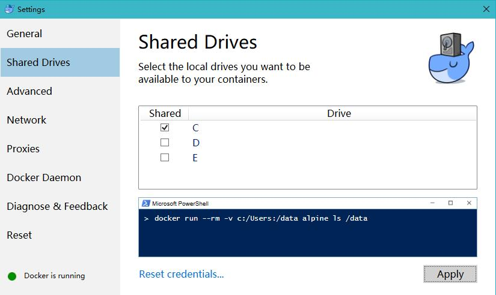

# Docker + Nginx + MySql + PHP 开发环境

## 目录结构

    ├── data 容器数据文件夹
    │   ├── mysql 数据库文件
    │   ├── redis 数据库文件
    │   └── ... 更多服务容器数据文件
    ├── log 日志文件夹 
    │   ├── mysql 日志文件
    │   ├── redis 日志文件
    │   ├── nginx 日志文件
    │   ├── php   日志文件
    │   └── ... 更多服务容器日志文件
    ├── sercie 服务文件夹
    │   ├── mysql 服务
    │   │   └── conf 配置文件
    │   ├── redis 服务
    │   │   └── conf 配置文件
    │   ├── php 服务
    │   │   ├—— php7.2
    │   │   └── ... 更多php版本
    │   ├── nginx 服务
    │   │   ├── conf 配置文件
    │   │   └───── conf.d 虚拟机配置文件 
    │   └── ... 更多服务容器日志文件
    ├── wwwroot 项目目录
    │   ├── site1
    │   ├── site2
    │   └── ... 更多项目
    ├── docker-compose.yml 服务自动化部署

## 常用 Docker 命令

### 1、镜像相关管理

#### 查看镜像列表
    
    docker image ls

#### 删除所有镜像

    docker rmi $(docker images -q)

`删除镜像之前请确保没有容器在使用当前镜像`

#### 删除指定格式的所有镜像

    docker rm $(docker ps -qf status=exited)
    
#### 删除所有未打 tag 的镜像

    docker rmi $(docker images -q | awk '/^<none>/ { print $3 }')   

### 2、容器相关管理

#### 查看容器列表
    
    # 查看运行中的容器
    docker ps
    # 查看所有容器
    docker ps -a
    
#### 启动、停止、重启容器

    # 启动一个或多个已经被停止的容器
    docker start [OPTIONS] CONTAINER [CONTAINER...]
    # 启动一个容器并进入交互模式
    docker start -i CONTAINER [CONTAINER...] 
    # 停止一个或多个正在运行的容器
    docker stop [OPTIONS] CONTAINER [CONTAINER...] 
    # 重启一个或多个容器，-t 在杀死容器之前等待停止秒数
    docker restart -t CONTAINER [CONTAINER...] 

#### 删除容器

    # 删除一个或多个容器
    docker rm [OPTIONS] CONTAINER [CONTAINER...]
    # 参数解释
    Options:
      -f, --force     强制删除正在运行的容器（使用SIGKILL）
      -l, --link      删除指定的链接
      -v, --volumes   删除与容器关联的卷
      
#### 删除所有未运行的容器

    docker rm $(docker ps -a -q)  

### 3、网络管理

#### 查看网络列表

    docker network ls 

#### 其他网络管理命令

    docker network connect	将容器连接到网络
    docker network create	创建网络
    docker network disconnect	从网络断开容器
    docker network inspect	显示一个或多个网络的详细信息
    docker network ls	列出网络
    docker network prune	删除所有未使用的网络
    docker network rm	删除一个或多个网络
    
### 4、docker-compose

#### 命令选项

- -f, --file FILE 指定使用的 Compose 模板文件，默认为 docker-compose.yml，可以多次指定。
- -p, --project-name NAME 指定项目名称，默认将使用所在目录名称作为项目名。
- --x-networking 使用 Docker 的可拔插网络后端特性
- --x-network-driver DRIVER 指定网络后端的驱动，默认为 bridge
- --verbose 输出更多调试信息。
- -v, --version 打印版本并退出

##### docker-compose -f

    # 指定 yml 文件，默认使用 docker-compose.yml 作为默认文件
    # 创建和启动容器（如果容器已经存在则直接启动容器）
    docker-compose -f docker-compose.yml up

##### docker-compose -p
    # 指定一个项目名称，默认使用当前目录的名称   
    docker-compose -p dnmp up
    
##### docker-compose --verbose
    # 输出详细信息
    docker-compose --verbose up
    
    
##### docker-compose --log-level
    # 设置日志级别，可选级别(DEBUG, INFO, WARNING, ERROR, CRITICAL)   
    docker-compose --log-level DEBUG up
    
    
##### docker-compose -v
    # 查看当前 compose 版本
    docker-compose -v
    
#### 命令使用说明

##### docker-compose up 

它将尝试自动完成包括构建镜像，（重新）创建服务，启动服务，并关联服务相关容器的一系列操作。链接的服务都将会被自动启动，除非已经处于运行状态。格式为 

    docker-compose up [options] [SERVICE...]。
 
大部分时候都可以直接通过该命令来启动一个项目。

默认情况，docker-compose up 启动的容器都在前台，控制台将会同时打印所有容器的输出信息，可以很方便进行调试。

当通过 Ctrl-C 停止命令时，所有容器将会停止。

如果使用 docker-compose up -d，将会在后台启动并运行所有的容器。一般推荐生产环境下使用该选项。

默认情况，如果服务容器已经存在，docker-compose up 将会尝试停止容器，然后重新创建（保持使用 volumes-from 挂载的卷），以保证新启动的服务匹配 docker-compose.yml 文件的最新内容。

如果用户不希望容器被停止并重新创建，可以使用 

    docker-compose up --no-recreate

这样将只会启动处于停止状态的容器，而忽略已经运行的服务。

如果用户只想重新部署某个服务，可以使用 

    docker-compose up --no-deps -d <SERVICE_NAME>

来重新创建服务并后台停止旧服务，启动新服务，并不会影响到其所依赖的服务。

选项：

- -d 在后台运行服务容器。
- --no-color 不使用颜色来区分不同的服务的控制台输出。
- --no-deps 不启动服务所链接的容器。
- --force-recreate 强制重新创建容器，不能与 --no-recreate 同时使用。
- --no-recreate 如果容器已经存在了，则不重新创建，不能与 --force-recreate 同时使用。
- --no-build 不自动构建缺失的服务镜像。
- -t, --timeout TIMEOUT 停止容器时候的超时（默认为 10 秒）。
    
##### docker-compose build

构建或重新构建服务。

服务一旦构建后，将会带上一个标记名，例如 web_db。

可以随时在项目目录下运行 docker-compose build 来重新构建服务。

选项包括：

- --force-rm 删除构建过程中的临时容器。

- --no-cache 构建镜像过程中不使用 cache（这将加长构建过程）。

- --pull 始终尝试通过 pull 来获取更新版本的镜像。

    
##### docker-compose config

**重要命令**：验证 Compose 文件格式是否正确，若正确则显示配置，若格式错误显示错误原因。

##### docker-compose images

列出 Compose 文件中包含的镜像。

##### docker-compose ps

列出所有容器。

##### docker-compose port

打印某个容器端口所映射的公共端口。格式为 

    docker-compose port [options] SERVICE PRIVATE_PORT。
    docker-compose port redis 6379
    
选项：

- --protocol=proto 指定端口协议，tcp（默认值）或者 udp。
- --index=index 如果同一服务存在多个容器，指定命令对象容器的序号（默认为 1）。

##### docker-compose kill

通过发送 SIGKILL 信号来强制停止服务容器。格式为 

    docker-compose kill [options] [SERVICE...]。
 

支持通过 -s 参数来指定发送的信号，例如通过如下指令发送 SIGINT 信号。

    docker-compose kill -s SIGINT

##### docker-compose logs

查看服务的输出

##### docker-compose pull

拉取 compose 中用到的服务镜像

##### docker-compose push

推送服务依赖的镜像到 Docker 镜像仓库。

##### docker-compose rm

删除停止的服务容器

用法：docker-compose rm 选项 服务名

选项：

     -f，强制删除容器（如果容器正在运行也能被删除）,一般尽量不要使用该选项。

     -s，选择删除容器，使用此选项删除容器时会提示是否选择删除（如果容器正在运行也能被删除）,一般尽量不要使用该选项。

     -v，删除容器的同时会删除附加到容器的任何匿名卷

##### docker-compose run 

在指定服务上执行一个命令。格式为 

    docker-compose run [options] [-p PORT...] [-e KEY=VAL...] SERVICE [COMMAND] [ARGS...]。

例如：

    docker-compose run ubuntu ping docker.com
   
将会启动一个 ubuntu 服务容器，并执行 ping docker.com 命令。

默认情况下，如果存在关联，则所有关联的服务将会自动被启动，除非这些服务已经在运行中。

该命令类似启动容器后运行指定的命令，相关卷、链接等等都将会按照配置自动创建。

两个不同点：

- 给定命令将会覆盖原有的自动运行命令；、
- 不会自动创建端口，以避免冲突。
    
如果不希望自动启动关联的容器，可以使用 --no-deps 选项，例如

    docker-compose run --no-deps web python manage.py shell
    
将不会启动 web 容器所关联的其它容器。

选项：

- -d 后台运行容器。
- --name NAME 为容器指定一个名字。
- --entrypoint CMD 覆盖默认的容器启动指令。
- -e KEY=VAL 设置环境变量值，可多次使用选项来设置多个环境变量。
- -u, --user="" 指定运行容器的用户名或者 uid。
- --no-deps 不自动启动关联的服务容器。
- --rm 运行命令后自动删除容器，d 模式下将忽略。
- -p, --publish=[] 映射容器端口到本地主机。
- --service-ports 配置服务端口并映射到本地主机。
- -T 不分配伪 tty，意味着依赖 tty 的指令将无法运行。

##### docker-compose scale

设置指定服务运行的容器个数。格式为

    docker-compose scale [options] [SERVICE=NUM...]。

通过 service=num 的参数来设置数量。例如：

    docker-compose scale web=3 db=2

将启动 3 个容器运行 web 服务，2 个容器运行 db 服务。

一般的，当指定数目多于该服务当前实际运行容器，将新创建并启动容器；反之，将停止容器。

选项：

- -t, --timeout TIMEOUT 停止容器时候的超时（默认为 10 秒）。

##### docker-compose start

启动已经存在的服务容器（可以是多个）。格式为 

    docker-compose start [SERVICE...]

##### docker-compose stop

停止已经处于运行状态的容器（可以是多个），但不删除它们。格式为 

    docker-compose stop [options] [SERVICE...]

##### docker-compose restart

重启项目中的服务。格式为 

    docker-compose restart [options] [SERVICE...]

选项：

- -t, --timeout TIMEOUT 指定重启前停止容器的超时（默认为 10 秒）。

##### docker-compose unpause

恢复处于暂停状态中的服务。格式为 

    docker-compose unpause [SERVICE...]。
    
##### docker-compose pause

暂停一个服务容器。格式为 

    docker-compose pause [SERVICE...]
    
##### docker-compose down

此命令将会停止 up 命令所启动的容器，并移除网络

##### docker-compose exec

进入指定的容器。和 docker exec 命令类似

# windows注意事项

#### 将测试域名 `site1.com` `www.site1.com` `site2.com` `www.site2.com` 配置到系统的hosts文件中

#### 使用管理员权限启动cmd

#### docker-composer.yml 中的 version 改为 2 如果 3 不行的话

#### 设置 docker 和 windows 共享 C 盘

如果没有设置共享，mysql和redis容器会启动失败。

